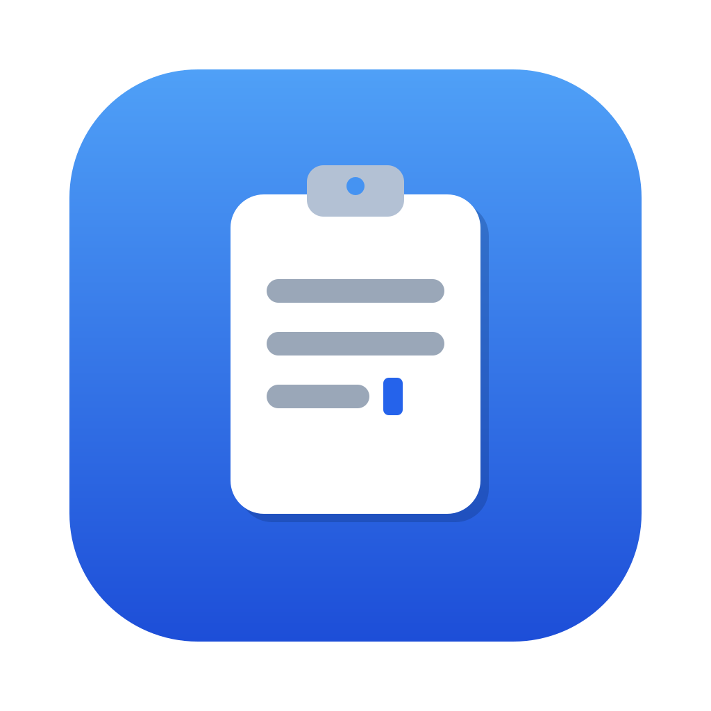

<p align="center"></p>

# cliptype

[简体中文](README.md) | **English**

Type the contents of your clipboard as simulated keystrokes.

`cliptype` reads whatever text is on your clipboard and "types" it out character
by character as real keyboard input. This is useful for fields that block
paste — remote desktop sessions, VMs, some password prompts, kiosk software, and
similar environments where <kbd>Ctrl/Cmd</kbd>+<kbd>V</kbd> simply doesn't work.

Cross-platform: **macOS** (native app + CLI), **Windows** (tray + CLI), and
**Linux** (CLI).

> Status: implemented and verified on macOS; Windows/Linux runtime verification
> is in progress. See the [Roadmap](#roadmap).

## Install

All packages are on the [GitHub Releases](https://github.com/Szyoo/cliptype/releases)
page. On macOS there are two ways to use cliptype — **pick either one**:

### macOS · Option 1: install the app (recommended)

GUI + resident menu bar icon, best for everyday use.

1. Download `cliptype-vX.Y.Z-macos-app-universal.zip` (runs on both
   Apple Silicon and Intel).
2. Unzip and drag **Cliptype.app** into your Applications folder.
3. The app is not developer-signed yet — clear the quarantine flag before the
   first launch:

   ```sh
   xattr -d com.apple.quarantine /Applications/Cliptype.app
   ```

4. Open Cliptype. On first launch it walks you through granting the permission:
   go to **System Settings → Privacy & Security → Accessibility** and enable
   **Cliptype** (this single entry also covers the bundled typing engine).
5. Copy some text → focus the target field → press <kbd>⌃⇧V</kbd>.
   The hotkey and typing speed are configurable in the main window or via the
   menu bar icon → Settings.

Later versions **update themselves**: the app checks GitHub Releases on launch
and every 24 hours (can be disabled in Settings), shows the release notes when
a new version exists, and on confirmation downloads it, verifies the SHA-256,
replaces the bundle and relaunches. "Check for Updates…" in the menu bar menu
checks manually. Because the app is not developer-signed yet, each update
requires granting the Accessibility permission once more (the prompt appears
automatically after the relaunch).

### macOS · Option 2: terminal CLI

No GUI — for developers and scripting.

1. Download `cliptype-vX.Y.Z-aarch64-apple-darwin.tar.gz` (Apple Silicon) or
   `x86_64-apple-darwin` (Intel) and extract the `cliptype` binary.
2. Clear the quarantine flag: `xattr -d com.apple.quarantine ./cliptype`
3. The permission goes to **the terminal app that runs it**: in System
   Settings → Accessibility, add and enable Terminal / iTerm / whatever you
   actually use, then **fully quit and reopen the terminal**.
4. See [CLI usage](#cli-usage) below.

> The two grants are independent: the app option authorizes Cliptype itself,
> the CLI option authorizes your terminal. See [Permissions](#permissions)
> below for details.

### Windows

Download `cliptype-vX.Y.Z-x86_64-pc-windows-msvc.zip` and extract
`cliptype.exe` — no extra setup. `cliptype.exe --tray` starts the resident
tray mode.

### Linux

Download `cliptype-vX.Y.Z-x86_64-unknown-linux-gnu.tar.gz` and extract (X11;
Wayland depends on your compositor, XWayland generally works). Requires
`libxdo` at runtime:

```sh
sudo apt-get install -y libxdo3   # Debian/Ubuntu runtime
```

### Build from source

Requires a [Rust toolchain](https://rustup.rs/); the macOS app additionally
needs the Xcode command line tools.

```sh
git clone https://github.com/Szyoo/cliptype
cd cliptype
cargo build --release            # CLI, binary at target/release/cliptype
scripts/bundle-macos.sh          # macOS app, output at dist/Cliptype.app
```

Linux build dependencies: `libxdo-dev` and the xcb development libraries (see
the CI config).

## Permissions

### macOS requires the Accessibility permission

Simulating keyboard input is a protected operation on macOS, so cliptype needs
the **Accessibility** permission: *System Settings → Privacy & Security →
Accessibility*.

**Which app you grant it to depends on how you run cliptype** — macOS grants
the permission to the process that initiates the action:

| How you run it | Grant the permission to | After granting |
| --- | --- | --- |
| Installed Cliptype.app | **Cliptype** | Relaunch Cliptype |
| `cliptype` in a terminal | **Your terminal app** (Terminal / iTerm / …) | **Fully quit** and reopen the terminal |
| `cargo run` / from an IDE | Same — the terminal or IDE running it | Same |

With the app, one entry is enough: the bundled typing engine runs as a child
process and inherits Cliptype's permission.

**Without the permission**, macOS **silently discards** every simulated
keystroke — the program looks like it worked, but nothing appears in the target
window. cliptype checks the permission before typing and exits with an error
instead of pretending to succeed.

### Granted it but it still doesn't work?

- **Trying it right after flipping the switch**: already-running processes
  don't pick up the new permission. For the CLI, **fully quit the terminal
  app** (⌘Q, not just closing the window) and reopen it; for the app, relaunch
  Cliptype.
- **After an update or rebuild the switch is on but nothing works**: the app is
  ad-hoc signed for now, so every build has a different signature. macOS ties
  the permission record to the **old version's signature**, so the Cliptype row
  looks enabled but the new build doesn't match it — and **turning the switch
  off and on doesn't help**, because that only flips the "allowed" flag without
  updating the recorded signature. You have to **recreate the record**:

  1. System Settings → Privacy & Security → Accessibility, select the
     **Cliptype** row
  2. Click **−** to remove it
  3. Click **+** and add Cliptype again (or relaunch Cliptype and follow its
     prompt)

  After an in-app update, if the permission is still missing 12 seconds after
  the relaunch, Cliptype shows these steps itself with a "Remove the entry for
  me" button (equivalent to `tccutil reset Accessibility io.github.szyoo.cliptype`).
  This goes away once the project is signed with an Apple Developer
  certificate.
- **Why do some permissions offer an "Allow" button while Accessibility needs a
  trip to System Settings?** That's macOS policy: Accessibility, Input
  Monitoring, Screen Recording and Full Disk Access are high-risk permissions,
  and the system deliberately offers no one-click approval — an app can only
  show a prompt with an "Open System Settings" button. Ordinary permissions
  (camera, microphone, folder access, …) get the "Allow / Don't Allow" dialog.
  No app can bypass or customize this.

### Folder access prompt during updates

If Cliptype.app lives in a protected folder (**Documents, Desktop or
Downloads**), macOS additionally asks for permission to access that folder when
the updater replaces the bundle — **the update stalls until you click Allow**.
Keeping Cliptype in the **Applications** folder avoids this entirely.

### Windows / Linux

- **Windows**: no permission setup at all.
- **Linux**: no system permission needed, but `libxdo` is required at runtime
  on X11 (Debian/Ubuntu: `sudo apt-get install -y libxdo3`). Wayland support
  depends on your compositor; XWayland generally works.

### Privacy

- Clipboard contents are used **locally only**, to simulate keystrokes. Nothing
  is uploaded anywhere.
- Clipboard contents **never** appear in logs, error messages or terminal
  output (the clipboard may hold a password); the only exception is the
  `--dry-run` flag you pass explicitly.
- The only network access is the macOS app's **update check** (GitHub
  Releases), which can be disabled in Settings. The CLI makes no network
  requests.

## CLI usage

```
cliptype [OPTIONS]

Options:
  -d, --delay <MS>      Delay before typing starts, in ms  [default: 2000]
  -i, --interval <MS>   Delay between keystrokes, in ms     [default: 0]
  -s, --speed <SPEED>   Typing speed preset  [possible values: fast, normal, slow]
  -m, --mode <MODE>     Delivery mode  [possible values: unicode, keycode]  [default: unicode]
      --dry-run         Print what would be typed instead of typing it
  -h, --help            Print help
  -V, --version         Print version
```

`--speed` is a friendlier alternative to `--interval` (fast = no delay,
normal = 20 ms, slow = 50 ms — for apps that drop keys at full speed).

`--mode` selects how keystrokes are delivered:

- `unicode` (default): Unicode text events — any character, immune to input
  methods, best for local apps.
- `keycode`: presses **real key codes** per character according to your current
  keyboard layout. **Required for VNC, remote consoles and VM windows** — they
  forward physical key codes and ignore attached Unicode text, so every
  character would otherwise arrive as `a`. Limited to characters on your layout
  (CJK etc. fall back to Unicode with a warning); the input source is switched
  to an ASCII layout while typing and restored afterwards.
  In the macOS app / tray menu this is the "Remote console mode (VNC / VM)"
  toggle.

```sh
# Copy some text, then:
cliptype --delay 3000
# Switch to the target window within 3s; the clipboard text is typed in.
```

### Resident hotkey mode (`--features hotkey`)

`cliptype --hotkey` stays resident and types the current clipboard every time
you press the hotkey — no countdown:

```sh
cliptype --hotkey                    # default combo: ctrl+shift+v
cliptype --hotkey "alt+F9"           # custom combo
cliptype --hotkey --interval 20      # per-character typing on each press
```

It waits until the modifiers are released before typing, so the combo doesn't
contaminate the output. Press <kbd>Ctrl</kbd>+<kbd>C</kbd> in the terminal to
quit.

### Status bar / tray mode (`--features tray`, macOS & Windows)

`cliptype --tray` adds a status bar icon on top of the hotkey mode: shows the
active hotkey, pause/resume, speed switching (persisted to
`~/.config/cliptype/config.toml`, `%APPDATA%\cliptype\` on Windows). For
everyday macOS use, prefer the native app (Option 1).

## Roadmap

- [x] Clipboard read & keystroke sending (Unicode / newline / tab, verified on macOS)
- [ ] Windows / Linux runtime verification
- [x] Resident hotkey mode (`--features hotkey`)
- [x] Status bar / tray UI (`--features tray`, macOS & Windows)
- [x] Native macOS app (main window + menu bar, UI in en/zh-Hans/ja)
- [x] Prebuilt releases: CLI for three platforms + macOS app (universal)
- [ ] App signing & notarization (once an Apple Developer certificate is set up)
- [ ] Native Windows UI

## Changelog

See [CHANGELOG.en.md](CHANGELOG.en.md) ([简体中文](CHANGELOG.md)).

## Contributing

Issues and pull requests are welcome. Please run `cargo fmt` and
`cargo clippy` before submitting.

## License

[MIT](LICENSE)
